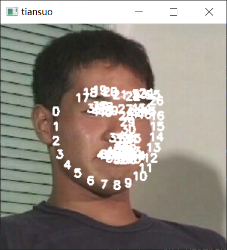
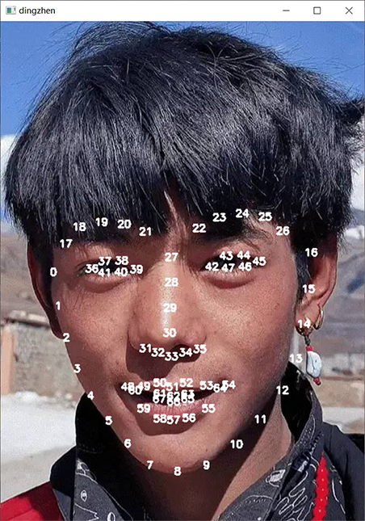

# 用python教你如何做一个和丁真的脸型比对的小玩具!

***


> 没错,时隔3天，我又回来了。对于自己的处女作，总是感到惴惴不安，一方面，因为这就是个玩具，怕被各路大神笑话，另一方面又觉得，处女作要是留下什么粗糙那就悲了，于是本着readme立下的flag，在此出个教程，或许之前已经有类似的或雷同的，请纯属巧合，也请各路大神嘴下留情，纸鹤不胜感激！

***请一定要看到最后,一定一定!***

## 正片开始

好的，废话不多说，下面就可以开始教学了！

**内容是** ：100行代码如何做一个**人脸相似度**的东东？

其实非常简单啊，先看一下效果：


> ~~请忽略丑丑的还像是被抓卖淫的图片,毕竟只有0.85左右的相似度(bushi)~~
>
> 或许和丁真不那么像还是件好事,是吧(doge) ~~不针对任何丁真粉~~


### 下面开始!

#### 前戏准备

> 首先需要准备一些东西

- `numpy`,一个开源的python科学计算包,强大到conda的base环境自带`numpy`  

  > 用`numpy`的原因是这个东东需要涉及到一些数学计算问题 

- `opencv`,也是一个开源的python库,用于计算机视觉方面    

- `dlib`,一个开源的机器学习库,因为人脸识别做得很好所以比较著名的说     

> 如果你的环境中已经有这三个库,那么可以点击右上角退出了,因为你大概率已经会这些了 ~~(或者也可以朝下看看然后嘲笑一下这篇教程的作者,他真菜,出这么低级的教程)~~
>
> 上面的库都装完以后,还需要一个东西,已经在repo里了,就是那个res文件夹下的`shape_predictor_68_face_landmarks.dat`,用处待会再说

如果想要更方便地安装上面的三个库,可以

> `pip install -r requirements.txt`

最好换成国内的pypi源,下载速度会高一点

> `pip install -r requirements.txt -i https://pypi.tuna.tsinghua.edu.cn/simple` 

我建议你从头开始,跟着这篇教程做一遍,思路会清晰一些,而不是看着我的 ~~屎码~~ 半天摸不着头脑    

#### 从摄像头读入你的face!

选择一个文件夹,在文件夹下新建一个python脚本文件`xxx.py`,将刚才准备的三大金刚请出来     

```python
import numpy as np
import dlib
import cv2
```

> `import sys`可选,主要是命令行参数要用,不用这个并不会影响到核心功能


首先将人脸通过摄像头读入

```python
#用到cv2这个库
cap = cv2.VideoCapture(0)
#实现持续截取摄像头画面并输出到屏幕上,就是连续的了
while True:
    ret,self_img = cap.read()
    self_img = cv2.flip(self_img,1)#镜像翻转摄像头的画面
    cv2.imshow('myself',img)
    cv2.waitKey(1)
```

> `cv2.VideoCapture(0)`代表默认摄像头,如果有多个摄像头而显示的不是你的预期,请换成1,2,.....直到报错,总有一款适合你      
>
> `cv2.imshow(text,img)`显示以text为标题,img为图片的窗口(text参照上图standard和myself)     
>
> `cv2.waitKey()`代表等待用户按下键盘的键才继续,这个不用管           


如果你成功了,你应该会在屏幕上看到一个人脸,如上图右不带红框和数字的样子(当然肯定不会有那个黑框,那个黑条是干嘛的呢?)        

***

#### 人脸识别!

如何把这张脸识别出来呢?  答案是`dlib`!

```python
def face_locator(img):
    detector = dlib.get_frontal_face_detector()
    dets = detector(img,0)
    if not dets:
        return None
    return max(dets,key = lambda d:d.area())
```

> `dlib.get_frontal_face_detector()`这个东东很神奇,可以将所有的人脸弄进一个列表里然后返回这个列表
>
> 最后返回最大的那张人脸 ~~(还不是为了防止被抢镜,所以请时刻保证在摄像头的视野中,你是最靓的靓仔)~~ ,用lambda表达式指定以面积为指标

#### 提取特征!

上面那个函数返回一个元素,我们虽然不知道这个元素是什么,但它有一些方法可以供我们操纵

令face = face_locator(img),则有以下`face.left()`,`face.right()`,`face.top()`,`face.bottom()`,`face.area()`,`face.width()`,`face.height()`等方法

用法一目了然,但现在暂时不用,待会会用到   


所以face现在就是个有坐标的矩形框,我们要从这个矩形框里面提取出脸的特征

```python
def extract_features(img,face):
    predictor = dlib.shape_predictor('res/shape_predictor_68_face_landmarks.dat')
	key_points = []
    landmark = predictor(img,face)
    for i in range(68):
		pos = landmark.part(i)
        key_points.append(np.array([pos.x,pos.y],dtype = np.float32))
    return key_points
```

> 这一步最关键的就是shape_predictor_68_face_landmarks.dat`,这个东西是dlib训练好的,可以提取人脸68特征点的一个模型       
>
> landmark就是一个类似于列表的东西,存放着68个点,访问每个点需要`part(下标)`  
>
> 但我们之后要用的是68个点而不是这个列不列表不表的鬼东西,而且这个"点"是dlib自己的一种数据结构,无法被其他库共用    
>
> 所以我们将这68个点一个一个一个提取出来变成numpy数组**(方便后续向量计算)**放入key_points列表,就达到了提取的效果       

> **题外话** :想要让python发挥**胶水语言**的功能,常常要借助比较底层的东西(本例**numpy**数组比较接近底层),可以更方便地黏合不同的包   

**效果**如下:






> 你是一个一个一个压力马斯内啊啊啊啊啊啊~~


#### 比对特征

上一步我们获得了一个含有68个点的列表`key_points`,这一步我们要完成比对,所以我们将丁真先生请出来  

按照上面的方法,如法炮制即可  

```python
dingzhen_img = cv2.imread('res/std_dingzhen.jpg')
dingzhen_locator = face_locator(dingzhen_img)
dingzhen_key_points = extract_features(dingzhen_img,dingzhen_locator)
```

现在我们得到了两个关键点列表`key_points` `dingzhen_key_points`    

但是现在这两个68点,他们的坐标不一样,同样都是鼻头,一个在图像中间,另一个在图像边缘,怎么比对呢?   


小学二年级的课程会教你平面向量这个东西,所以我们只需要将两个点作差,就可以得到一个向量   

点的坐标是绝对的,而向量的坐标是相对的,这样就解决了点的坐标不同的问题

```python
for i in range(68):
	key_points[i]-=key_points[0]
    dingzhen_key_points[i]-=dingzhen_key_points[0]
```


然后我们就可以比对对应向量的差距,可以用欧几里得距离,即两个同尾向量,头部之间的距离  

>  欧氏距离越大,两向量差距越大,对应的部分就越不像,如果这个差距被累积起来,就可以衡量整张人脸的差距

按照这个思路,我们来计算对应向量欧氏距离的总和

```python
sum = 0
for i in range(68):
    sum+=np.linalg.norm(key_points[i]-dingzhen_key_points[i])
```

> np.linalg.norm()是用来计算向量范数的,默认情况下就是计算模长,即两向量的欧氏距离
>
> 因为两向量作差就是一个向量嘛


这样我们得到了欧氏距离的和,这个和越大,就说明两张脸越不像,很好理解   

但是我们要的是**相似度**啊,**相似度**是一个比率啊!   

所以我们需要一个能把实数映射到0到1之间的函数   

> 这时候可能有深度学习基础的小伙伴就懂了,这不就是激活函数嘛

再结合0到1的范围,我们便可以确定两个函数符合我们的要求

- `sigmoid`函数
- `tanh`(双曲正切函数)


1. **sigmoid**函数,解析式  ,图象如下图


<svg version="1.1" xmlns="http://www.w3.org/2000/svg" xmlns:xlink="http://www.w3.org/1999/xlink" width="800" height="800"><defs/><g transform="scale(2,2)"><g id="background-2b8cf4fe"><rect fill="white" stroke="none" x="0" y="0" width="400" height="400" class="dcg-svg-background"/></g><g id="background-images-2b8cf4fe"/><g id="graphpaper-2b8cf4fe"><g id="grid-2b8cf4fe"><g><path fill="none" stroke="rgb(0,0,0)" class="dcg-svg-minor-gridline" paint-order="fill stroke markers" d=" M 20.5 0 L 20.5 400" stroke-opacity="0.2" stroke-miterlimit="10" stroke-dasharray=""/><path fill="none" stroke="rgb(0,0,0)" class="dcg-svg-minor-gridline" paint-order="fill stroke markers" d=" M 41.5 0 L 41.5 400" stroke-opacity="0.2" stroke-miterlimit="10" stroke-dasharray=""/><path fill="none" stroke="rgb(0,0,0)" class="dcg-svg-minor-gridline" paint-order="fill stroke markers" d=" M 61.5 0 L 61.5 400" stroke-opacity="0.2" stroke-miterlimit="10" stroke-dasharray=""/><path fill="none" stroke="rgb(0,0,0)" class="dcg-svg-minor-gridline" paint-order="fill stroke markers" d=" M 82.5 0 L 82.5 400" stroke-opacity="0.2" stroke-miterlimit="10" stroke-dasharray=""/><path fill="none" stroke="rgb(0,0,0)" class="dcg-svg-minor-gridline" paint-order="fill stroke markers" d=" M 103.5 0 L 103.5 400" stroke-opacity="0.2" stroke-miterlimit="10" stroke-dasharray=""/><path fill="none" stroke="rgb(0,0,0)" class="dcg-svg-minor-gridline" paint-order="fill stroke markers" d=" M 123.5 0 L 123.5 400" stroke-opacity="0.2" stroke-miterlimit="10" stroke-dasharray=""/><path fill="none" stroke="rgb(0,0,0)" class="dcg-svg-minor-gridline" paint-order="fill stroke markers" d=" M 144.5 0 L 144.5 400" stroke-opacity="0.2" stroke-miterlimit="10" stroke-dasharray=""/><path fill="none" stroke="rgb(0,0,0)" class="dcg-svg-minor-gridline" paint-order="fill stroke markers" d=" M 165.5 0 L 165.5 400" stroke-opacity="0.2" stroke-miterlimit="10" stroke-dasharray=""/><path fill="none" stroke="rgb(0,0,0)" class="dcg-svg-minor-gridline" paint-order="fill stroke markers" d=" M 206.5 0 L 206.5 400" stroke-opacity="0.2" stroke-miterlimit="10" stroke-dasharray=""/><path fill="none" stroke="rgb(0,0,0)" class="dcg-svg-minor-gridline" paint-order="fill stroke markers" d=" M 227.5 0 L 227.5 400" stroke-opacity="0.2" stroke-miterlimit="10" stroke-dasharray=""/><path fill="none" stroke="rgb(0,0,0)" class="dcg-svg-minor-gridline" paint-order="fill stroke markers" d=" M 248.5 0 L 248.5 400" stroke-opacity="0.2" stroke-miterlimit="10" stroke-dasharray=""/><path fill="none" stroke="rgb(0,0,0)" class="dcg-svg-minor-gridline" paint-order="fill stroke markers" d=" M 268.5 0 L 268.5 400" stroke-opacity="0.2" stroke-miterlimit="10" stroke-dasharray=""/><path fill="none" stroke="rgb(0,0,0)" class="dcg-svg-minor-gridline" paint-order="fill stroke markers" d=" M 289.5 0 L 289.5 400" stroke-opacity="0.2" stroke-miterlimit="10" stroke-dasharray=""/><path fill="none" stroke="rgb(0,0,0)" class="dcg-svg-minor-gridline" paint-order="fill stroke markers" d=" M 310.5 0 L 310.5 400" stroke-opacity="0.2" stroke-miterlimit="10" stroke-dasharray=""/><path fill="none" stroke="rgb(0,0,0)" class="dcg-svg-minor-gridline" paint-order="fill stroke markers" d=" M 330.5 0 L 330.5 400" stroke-opacity="0.2" stroke-miterlimit="10" stroke-dasharray=""/><path fill="none" stroke="rgb(0,0,0)" class="dcg-svg-minor-gridline" paint-order="fill stroke markers" d=" M 351.5 0 L 351.5 400" stroke-opacity="0.2" stroke-miterlimit="10" stroke-dasharray=""/><path fill="none" stroke="rgb(0,0,0)" class="dcg-svg-minor-gridline" paint-order="fill stroke markers" d=" M 372.5 0 L 372.5 400" stroke-opacity="0.2" stroke-miterlimit="10" stroke-dasharray=""/><path fill="none" stroke="rgb(0,0,0)" class="dcg-svg-minor-gridline" paint-order="fill stroke markers" d=" M 392.5 0 L 392.5 400" stroke-opacity="0.2" stroke-miterlimit="10" stroke-dasharray=""/><path fill="none" stroke="rgb(0,0,0)" class="dcg-svg-minor-gridline" paint-order="fill stroke markers" d=" M 0 379.5 L 400 379.5" stroke-opacity="0.2" stroke-miterlimit="10" stroke-dasharray=""/><path fill="none" stroke="rgb(0,0,0)" class="dcg-svg-minor-gridline" paint-order="fill stroke markers" d=" M 0 356.5 L 400 356.5" stroke-opacity="0.2" stroke-miterlimit="10" stroke-dasharray=""/><path fill="none" stroke="rgb(0,0,0)" class="dcg-svg-minor-gridline" paint-order="fill stroke markers" d=" M 0 333.5 L 400 333.5" stroke-opacity="0.2" stroke-miterlimit="10" stroke-dasharray=""/><path fill="none" stroke="rgb(0,0,0)" class="dcg-svg-minor-gridline" paint-order="fill stroke markers" d=" M 0 311.5 L 400 311.5" stroke-opacity="0.2" stroke-miterlimit="10" stroke-dasharray=""/><path fill="none" stroke="rgb(0,0,0)" class="dcg-svg-minor-gridline" paint-order="fill stroke markers" d=" M 0 288.5 L 400 288.5" stroke-opacity="0.2" stroke-miterlimit="10" stroke-dasharray=""/><path fill="none" stroke="rgb(0,0,0)" class="dcg-svg-minor-gridline" paint-order="fill stroke markers" d=" M 0 266.5 L 400 266.5" stroke-opacity="0.2" stroke-miterlimit="10" stroke-dasharray=""/><path fill="none" stroke="rgb(0,0,0)" class="dcg-svg-minor-gridline" paint-order="fill stroke markers" d=" M 0 220.5 L 400 220.5" stroke-opacity="0.2" stroke-miterlimit="10" stroke-dasharray=""/><path fill="none" stroke="rgb(0,0,0)" class="dcg-svg-minor-gridline" paint-order="fill stroke markers" d=" M 0 198.5 L 400 198.5" stroke-opacity="0.2" stroke-miterlimit="10" stroke-dasharray=""/><path fill="none" stroke="rgb(0,0,0)" class="dcg-svg-minor-gridline" paint-order="fill stroke markers" d=" M 0 175.5 L 400 175.5" stroke-opacity="0.2" stroke-miterlimit="10" stroke-dasharray=""/><path fill="none" stroke="rgb(0,0,0)" class="dcg-svg-minor-gridline" paint-order="fill stroke markers" d=" M 0 153.5 L 400 153.5" stroke-opacity="0.2" stroke-miterlimit="10" stroke-dasharray=""/><path fill="none" stroke="rgb(0,0,0)" class="dcg-svg-minor-gridline" paint-order="fill stroke markers" d=" M 0 130.5 L 400 130.5" stroke-opacity="0.2" stroke-miterlimit="10" stroke-dasharray=""/><path fill="none" stroke="rgb(0,0,0)" class="dcg-svg-minor-gridline" paint-order="fill stroke markers" d=" M 0 108.5 L 400 108.5" stroke-opacity="0.2" stroke-miterlimit="10" stroke-dasharray=""/><path fill="none" stroke="rgb(0,0,0)" class="dcg-svg-minor-gridline" paint-order="fill stroke markers" d=" M 0 85.5 L 400 85.5" stroke-opacity="0.2" stroke-miterlimit="10" stroke-dasharray=""/><path fill="none" stroke="rgb(0,0,0)" class="dcg-svg-minor-gridline" paint-order="fill stroke markers" d=" M 0 62.5 L 400 62.5" stroke-opacity="0.2" stroke-miterlimit="10" stroke-dasharray=""/><path fill="none" stroke="rgb(0,0,0)" class="dcg-svg-minor-gridline" paint-order="fill stroke markers" d=" M 0 40.5 L 400 40.5" stroke-opacity="0.2" stroke-miterlimit="10" stroke-dasharray=""/><path fill="none" stroke="rgb(0,0,0)" class="dcg-svg-minor-gridline" paint-order="fill stroke markers" d=" M 0 17.5 L 400 17.5" stroke-opacity="0.2" stroke-miterlimit="10" stroke-dasharray=""/><path fill="none" stroke="rgb(0,0,0)" class="dcg-svg-major-gridline" paint-order="fill stroke markers" d=" M 20.5 0 L 20.5 400" stroke-opacity="0.2500000000000001" stroke-miterlimit="10" stroke-dasharray=""/><path fill="none" stroke="rgb(0,0,0)" class="dcg-svg-major-gridline" paint-order="fill stroke markers" d=" M 103.5 0 L 103.5 400" stroke-opacity="0.2500000000000001" stroke-miterlimit="10" stroke-dasharray=""/><path fill="none" stroke="rgb(0,0,0)" class="dcg-svg-major-gridline" paint-order="fill stroke markers" d=" M 268.5 0 L 268.5 400" stroke-opacity="0.2500000000000001" stroke-miterlimit="10" stroke-dasharray=""/><path fill="none" stroke="rgb(0,0,0)" class="dcg-svg-major-gridline" paint-order="fill stroke markers" d=" M 351.5 0 L 351.5 400" stroke-opacity="0.2500000000000001" stroke-miterlimit="10" stroke-dasharray=""/><path fill="none" stroke="rgb(0,0,0)" class="dcg-svg-major-gridline" paint-order="fill stroke markers" d=" M 0 356 L 400 356" stroke-opacity="0.2500000000000001" stroke-miterlimit="10" stroke-dasharray=""/><path fill="none" stroke="rgb(0,0,0)" class="dcg-svg-major-gridline" paint-order="fill stroke markers" d=" M 0 131 L 400 131" stroke-opacity="0.2500000000000001" stroke-miterlimit="10" stroke-dasharray=""/><path fill="none" stroke="rgb(0,0,0)" class="dcg-svg-major-gridline" paint-order="fill stroke markers" d=" M 0 18 L 400 18" stroke-opacity="0.2500000000000001" stroke-miterlimit="10" stroke-dasharray=""/></g></g><g id="axis-2b8cf4fe"><g id="yaxis-2b8cf4fe"><title>Y axis</title><path fill="none" stroke="rgb(0,0,0)" class="dcg-svg-axis-line" paint-order="fill stroke markers" d=" M 186 0 L 186 400" stroke-opacity="0.9" stroke-miterlimit="10" stroke-width="1.5" stroke-dasharray=""/></g><g id="xaxis-2b8cf4fe"><title>X axis</title><path fill="none" stroke="rgb(0,0,0)" class="dcg-svg-axis-line" paint-order="fill stroke markers" d=" M 0 244 L 400 244" stroke-opacity="0.9" stroke-miterlimit="10" stroke-width="1.5" stroke-dasharray=""/></g><g><g class="dcg-svg-axis-value"><text fill="none" stroke="#ffffff" font-family="Arial" font-size="14px" font-style="normal" font-weight="normal" text-decoration="normal" x="177.11689271619875" y="259.3800387243741" text-anchor="middle" stroke-miterlimit="2" stroke-width="3" stroke-dasharray="">0</text><text fill="#000000" stroke="none" font-family="Arial" font-size="14px" font-style="normal" font-weight="normal" text-decoration="normal" x="177.11689271619875" y="259.3800387243741" text-anchor="middle">0</text></g><g class="dcg-svg-axis-value"><text fill="none" stroke="#ffffff" font-family="Arial" font-size="14px" font-style="normal" font-weight="normal" text-decoration="normal" x="18.087705092587015" y="259.3800387243741" text-anchor="middle" stroke-miterlimit="2" stroke-width="3" stroke-dasharray="">-4</text><text fill="#000000" stroke="none" font-family="Arial" font-size="14px" font-style="normal" font-weight="normal" text-decoration="normal" x="18.087705092587015" y="259.3800387243741" text-anchor="middle">-4</text></g><g class="dcg-svg-axis-value"><text fill="none" stroke="#ffffff" font-family="Arial" font-size="14px" font-style="normal" font-weight="normal" text-decoration="normal" x="100.88330476376788" y="259.3800387243741" text-anchor="middle" stroke-miterlimit="2" stroke-width="3" stroke-dasharray="">-2</text><text fill="#000000" stroke="none" font-family="Arial" font-size="14px" font-style="normal" font-weight="normal" text-decoration="normal" x="100.88330476376788" y="259.3800387243741" text-anchor="middle">-2</text></g><g class="dcg-svg-axis-value"><text fill="none" stroke="#ffffff" font-family="Arial" font-size="14px" font-style="normal" font-weight="normal" text-decoration="normal" x="268.80555879362964" y="259.3800387243741" text-anchor="middle" stroke-miterlimit="2" stroke-width="3" stroke-dasharray="">2</text><text fill="#000000" stroke="none" font-family="Arial" font-size="14px" font-style="normal" font-weight="normal" text-decoration="normal" x="268.80555879362964" y="259.3800387243741" text-anchor="middle">2</text></g><g class="dcg-svg-axis-value"><text fill="none" stroke="#ffffff" font-family="Arial" font-size="14px" font-style="normal" font-weight="normal" text-decoration="normal" x="351.6011584648105" y="259.3800387243741" text-anchor="middle" stroke-miterlimit="2" stroke-width="3" stroke-dasharray="">4</text><text fill="#000000" stroke="none" font-family="Arial" font-size="14px" font-style="normal" font-weight="normal" text-decoration="normal" x="351.6011584648105" y="259.3800387243741" text-anchor="middle">4</text></g><g class="dcg-svg-axis-value"><text fill="none" stroke="#ffffff" font-family="Arial" font-size="14px" font-style="normal" font-weight="normal" text-decoration="normal" x="174.78583802869875" y="360.2706637243741" text-anchor="middle" stroke-miterlimit="2" stroke-width="3" stroke-dasharray="">-1</text><text fill="#000000" stroke="none" font-family="Arial" font-size="14px" font-style="normal" font-weight="normal" text-decoration="normal" x="174.78583802869875" y="360.2706637243741" text-anchor="middle">-1</text></g><g class="dcg-svg-axis-value"><text fill="none" stroke="#ffffff" font-family="Arial" font-size="14px" font-style="normal" font-weight="normal" text-decoration="normal" x="177.11689271619875" y="134.4894137243741" text-anchor="middle" stroke-miterlimit="2" stroke-width="3" stroke-dasharray="">1</text><text fill="#000000" stroke="none" font-family="Arial" font-size="14px" font-style="normal" font-weight="normal" text-decoration="normal" x="177.11689271619875" y="134.4894137243741" text-anchor="middle">1</text></g><g class="dcg-svg-axis-value"><text fill="none" stroke="#ffffff" font-family="Arial" font-size="14px" font-style="normal" font-weight="normal" text-decoration="normal" x="177.11689271619875" y="21.598788724374096" text-anchor="middle" stroke-miterlimit="2" stroke-width="3" stroke-dasharray="">2</text><text fill="#000000" stroke="none" font-family="Arial" font-size="14px" font-style="normal" font-weight="normal" text-decoration="normal" x="177.11689271619875" y="21.598788724374096" text-anchor="middle">2</text></g></g></g></g><g id="expressions-2b8cf4fe"><g id="sketch-2b8cf4fe"><title>Expression 1</title><path fill="#2d70b3" stroke="none" paint-order="stroke fill markers" d="" fill-opacity="0.4"/><g><path fill="none" stroke="#2d70b3" class="dcg-svg-curve" paint-order="fill stroke markers" d=" M 0 242.3233872904412 L 0 242.3233872904412 L 17.871093749999968 241.66070267367775 L 32.71484375000001 240.85622680459147 L 45.41015625 239.91314584267369 L 56.54296875000001 238.83158640459402 L 66.6015625 237.59680220253506 L 75.78125 236.21017706884186 L 84.17968749999999 234.68473497430526 L 92.08984375 232.98891523122828 L 99.51171874999999 231.13968870429585 L 106.640625 229.10282992398479 L 113.4765625 226.88888440159315 L 120.1171875 224.47712975755545 L 126.66015625 221.83707314483246 L 133.20312499999997 218.92790765567574 L 139.74609374999997 215.74821161786267 L 146.38671874999997 212.2502650925085 L 153.3203125 208.32256424119768 L 160.64453125 203.89797711882397 L 168.84765624999997 198.66225938975606 L 179.1015625 191.82557703581185 L 205.76171875 173.91086791663776 L 213.96484375 168.7613144113845 L 221.28906249999997 164.43255820128363 L 228.22265624999997 160.60745966285825 L 234.86328125 157.21468189458182 L 241.40625 154.14179598545243 L 247.94921875 151.33965623224074 L 254.49218749999997 148.8043828934598 L 261.1328125 146.494691337497 L 267.96875 144.37974684593385 L 275.09765625 142.438442652787 L 282.61718749999994 140.6581922546365 L 290.52734375 139.05158308694917 L 298.92578125 137.6089910166355 L 308.0078125 136.3124168531847 L 317.96874999999994 135.15592408174803 L 329.00390625 134.14100642654478 L 341.40625 133.2658993419305 L 355.76171874999994 132.52090453013756 L 372.75390624999994 131.90836001697238 L 393.75 131.423479307867 L 399.99999999999994 131.32008185598988" stroke-linecap="round" stroke-linejoin="round" stroke-miterlimit="10" stroke-width="2.5" stroke-opacity="0.9" stroke-dasharray=""/></g></g></g><g id="labels-2b8cf4fe"/></g></svg>


2. **tanh**双曲正切函数,解析式    ,图象如下图


<svg version="1.1" xmlns="http://www.w3.org/2000/svg" xmlns:xlink="http://www.w3.org/1999/xlink" width="800" height="800"><defs/><g transform="scale(2,2)"><g id="background-a301c7be"><rect fill="white" stroke="none" x="0" y="0" width="400" height="400" class="dcg-svg-background"/></g><g id="background-images-a301c7be"/><g id="graphpaper-a301c7be"><g id="grid-a301c7be"><g><path fill="none" stroke="rgb(0,0,0)" class="dcg-svg-minor-gridline" paint-order="fill stroke markers" d=" M 10.5 0 L 10.5 400" stroke-opacity="0.2" stroke-miterlimit="10" stroke-dasharray=""/><path fill="none" stroke="rgb(0,0,0)" class="dcg-svg-minor-gridline" paint-order="fill stroke markers" d=" M 46.5 0 L 46.5 400" stroke-opacity="0.2" stroke-miterlimit="10" stroke-dasharray=""/><path fill="none" stroke="rgb(0,0,0)" class="dcg-svg-minor-gridline" paint-order="fill stroke markers" d=" M 81.5 0 L 81.5 400" stroke-opacity="0.2" stroke-miterlimit="10" stroke-dasharray=""/><path fill="none" stroke="rgb(0,0,0)" class="dcg-svg-minor-gridline" paint-order="fill stroke markers" d=" M 117.5 0 L 117.5 400" stroke-opacity="0.2" stroke-miterlimit="10" stroke-dasharray=""/><path fill="none" stroke="rgb(0,0,0)" class="dcg-svg-minor-gridline" paint-order="fill stroke markers" d=" M 153.5 0 L 153.5 400" stroke-opacity="0.2" stroke-miterlimit="10" stroke-dasharray=""/><path fill="none" stroke="rgb(0,0,0)" class="dcg-svg-minor-gridline" paint-order="fill stroke markers" d=" M 224.5 0 L 224.5 400" stroke-opacity="0.2" stroke-miterlimit="10" stroke-dasharray=""/><path fill="none" stroke="rgb(0,0,0)" class="dcg-svg-minor-gridline" paint-order="fill stroke markers" d=" M 260.5 0 L 260.5 400" stroke-opacity="0.2" stroke-miterlimit="10" stroke-dasharray=""/><path fill="none" stroke="rgb(0,0,0)" class="dcg-svg-minor-gridline" paint-order="fill stroke markers" d=" M 296.5 0 L 296.5 400" stroke-opacity="0.2" stroke-miterlimit="10" stroke-dasharray=""/><path fill="none" stroke="rgb(0,0,0)" class="dcg-svg-minor-gridline" paint-order="fill stroke markers" d=" M 331.5 0 L 331.5 400" stroke-opacity="0.2" stroke-miterlimit="10" stroke-dasharray=""/><path fill="none" stroke="rgb(0,0,0)" class="dcg-svg-minor-gridline" paint-order="fill stroke markers" d=" M 367.5 0 L 367.5 400" stroke-opacity="0.2" stroke-miterlimit="10" stroke-dasharray=""/><path fill="none" stroke="rgb(0,0,0)" class="dcg-svg-minor-gridline" paint-order="fill stroke markers" d=" M 0 383.5 L 400 383.5" stroke-opacity="0.2" stroke-miterlimit="10" stroke-dasharray=""/><path fill="none" stroke="rgb(0,0,0)" class="dcg-svg-minor-gridline" paint-order="fill stroke markers" d=" M 0 347.5 L 400 347.5" stroke-opacity="0.2" stroke-miterlimit="10" stroke-dasharray=""/><path fill="none" stroke="rgb(0,0,0)" class="dcg-svg-minor-gridline" paint-order="fill stroke markers" d=" M 0 312.5 L 400 312.5" stroke-opacity="0.2" stroke-miterlimit="10" stroke-dasharray=""/><path fill="none" stroke="rgb(0,0,0)" class="dcg-svg-minor-gridline" paint-order="fill stroke markers" d=" M 0 276.5 L 400 276.5" stroke-opacity="0.2" stroke-miterlimit="10" stroke-dasharray=""/><path fill="none" stroke="rgb(0,0,0)" class="dcg-svg-minor-gridline" paint-order="fill stroke markers" d=" M 0 240.5 L 400 240.5" stroke-opacity="0.2" stroke-miterlimit="10" stroke-dasharray=""/><path fill="none" stroke="rgb(0,0,0)" class="dcg-svg-minor-gridline" paint-order="fill stroke markers" d=" M 0 169.5 L 400 169.5" stroke-opacity="0.2" stroke-miterlimit="10" stroke-dasharray=""/><path fill="none" stroke="rgb(0,0,0)" class="dcg-svg-minor-gridline" paint-order="fill stroke markers" d=" M 0 133.5 L 400 133.5" stroke-opacity="0.2" stroke-miterlimit="10" stroke-dasharray=""/><path fill="none" stroke="rgb(0,0,0)" class="dcg-svg-minor-gridline" paint-order="fill stroke markers" d=" M 0 97.5 L 400 97.5" stroke-opacity="0.2" stroke-miterlimit="10" stroke-dasharray=""/><path fill="none" stroke="rgb(0,0,0)" class="dcg-svg-minor-gridline" paint-order="fill stroke markers" d=" M 0 62.5 L 400 62.5" stroke-opacity="0.2" stroke-miterlimit="10" stroke-dasharray=""/><path fill="none" stroke="rgb(0,0,0)" class="dcg-svg-minor-gridline" paint-order="fill stroke markers" d=" M 0 26.5 L 400 26.5" stroke-opacity="0.2" stroke-miterlimit="10" stroke-dasharray=""/><path fill="none" stroke="rgb(0,0,0)" class="dcg-svg-major-gridline" paint-order="fill stroke markers" d=" M 46.5 0 L 46.5 400" stroke-opacity="0.2500000000000001" stroke-miterlimit="10" stroke-dasharray=""/><path fill="none" stroke="rgb(0,0,0)" class="dcg-svg-major-gridline" paint-order="fill stroke markers" d=" M 331.5 0 L 331.5 400" stroke-opacity="0.2500000000000001" stroke-miterlimit="10" stroke-dasharray=""/><path fill="none" stroke="rgb(0,0,0)" class="dcg-svg-major-gridline" paint-order="fill stroke markers" d=" M 0 348 L 400 348" stroke-opacity="0.2500000000000001" stroke-miterlimit="10" stroke-dasharray=""/><path fill="none" stroke="rgb(0,0,0)" class="dcg-svg-major-gridline" paint-order="fill stroke markers" d=" M 0 62 L 400 62" stroke-opacity="0.2500000000000001" stroke-miterlimit="10" stroke-dasharray=""/></g></g><g id="axis-a301c7be"><g id="yaxis-a301c7be"><title>Y axis</title><path fill="none" stroke="rgb(0,0,0)" class="dcg-svg-axis-line" paint-order="fill stroke markers" d=" M 189 0 L 189 400" stroke-opacity="0.9" stroke-miterlimit="10" stroke-width="1.5" stroke-dasharray=""/></g><g id="xaxis-a301c7be"><title>X axis</title><path fill="none" stroke="rgb(0,0,0)" class="dcg-svg-axis-line" paint-order="fill stroke markers" d=" M 0 205 L 400 205" stroke-opacity="0.9" stroke-miterlimit="10" stroke-width="1.5" stroke-dasharray=""/></g><g><g class="dcg-svg-axis-value"><text fill="none" stroke="#ffffff" font-family="Arial" font-size="14px" font-style="normal" font-weight="normal" text-decoration="normal" x="180.18856897541514" y="220.7174223180728" text-anchor="middle" stroke-miterlimit="2" stroke-width="3" stroke-dasharray="">0</text><text fill="#000000" stroke="none" font-family="Arial" font-size="14px" font-style="normal" font-weight="normal" text-decoration="normal" x="180.18856897541514" y="220.7174223180728" text-anchor="middle">0</text></g><g class="dcg-svg-axis-value"><text fill="none" stroke="#ffffff" font-family="Arial" font-size="14px" font-style="normal" font-weight="normal" text-decoration="normal" x="43.87181015257548" y="220.7174223180728" text-anchor="middle" stroke-miterlimit="2" stroke-width="3" stroke-dasharray="">-2</text><text fill="#000000" stroke="none" font-family="Arial" font-size="14px" font-style="normal" font-weight="normal" text-decoration="normal" x="43.87181015257548" y="220.7174223180728" text-anchor="middle">-2</text></g><g class="dcg-svg-axis-value"><text fill="none" stroke="#ffffff" font-family="Arial" font-size="14px" font-style="normal" font-weight="normal" text-decoration="normal" x="331.9604059232548" y="220.7174223180728" text-anchor="middle" stroke-miterlimit="2" stroke-width="3" stroke-dasharray="">2</text><text fill="#000000" stroke="none" font-family="Arial" font-size="14px" font-style="normal" font-weight="normal" text-decoration="normal" x="331.9604059232548" y="220.7174223180728" text-anchor="middle">2</text></g><g class="dcg-svg-axis-value"><text fill="none" stroke="#ffffff" font-family="Arial" font-size="14px" font-style="normal" font-weight="normal" text-decoration="normal" x="177.85751428791514" y="351.59619285966244" text-anchor="middle" stroke-miterlimit="2" stroke-width="3" stroke-dasharray="">-2</text><text fill="#000000" stroke="none" font-family="Arial" font-size="14px" font-style="normal" font-weight="normal" text-decoration="normal" x="177.85751428791514" y="351.59619285966244" text-anchor="middle">-2</text></g><g class="dcg-svg-axis-value"><text fill="none" stroke="#ffffff" font-family="Arial" font-size="14px" font-style="normal" font-weight="normal" text-decoration="normal" x="180.18856897541514" y="65.83865177648316" text-anchor="middle" stroke-miterlimit="2" stroke-width="3" stroke-dasharray="">2</text><text fill="#000000" stroke="none" font-family="Arial" font-size="14px" font-style="normal" font-weight="normal" text-decoration="normal" x="180.18856897541514" y="65.83865177648316" text-anchor="middle">2</text></g></g></g></g><g id="expressions-a301c7be"><g id="sketch-a301c7be"><title>Expression 1</title><path fill="#c74440" stroke="none" paint-order="stroke fill markers" d="" fill-opacity="0.4"/><g><path fill="none" stroke="#c74440" class="dcg-svg-curve" paint-order="fill stroke markers" d=" M 0 275.6345413637543 L 0 275.6345413637543 L 19.726562499999996 275.11255811614285 L 35.15624999999998 274.45349427285527 L 47.94921875000001 273.65262668319974 L 58.88671875 272.7112873628374 L 68.45703125000001 271.630554983113 L 77.05078124999999 270.4006288270532 L 84.86328125 269.0210061755904 L 92.08984375000001 267.47987759513063 L 98.828125 265.7748642854989 L 105.2734375 263.86658035302577 L 111.42578124999999 261.7599525029782 L 117.38281249999999 259.42589678771833 L 123.14453125 256.8675726473773 L 128.80859375 254.04265568879322 L 134.47265625 250.89261068187446 L 140.234375 247.34135544080516 L 146.09375 243.36424718289197 L 152.1484375 238.8696229189914 L 158.49609375 233.75376379566606 L 165.13671874999997 227.99618966943163 L 172.36328125 221.32911774404732 L 181.15234375 212.80631195376205 L 208.88671875 185.59659145014768 L 216.015625 179.18298172624313 L 222.55859375 173.6852184695177 L 228.80859375 168.82731629373995 L 234.96093750000003 164.44583466267474 L 240.91796875 160.5909020297787 L 246.77734375 157.16834278268584 L 252.53906250000003 154.14902774610331 L 258.30078125 151.45633810801135 L 264.16015625 149.031563069348 L 270.21484375 146.83215280486877 L 276.46484375 144.8582154559176 L 283.00781250000006 143.08029550059916 L 289.94140625 141.47977523614412 L 297.36328125 140.04619301973503 L 305.37109375000006 138.77451890971633 L 314.16015625 137.65135504395192 L 323.92578125 136.67357371063343 L 335.05859375 135.8299055213884 L 347.94921875 135.12328052571593 L 363.37890625 134.5477490026285 L 382.71484375 134.099224530992 L 400 133.85850433812664" stroke-linecap="round" stroke-linejoin="round" stroke-miterlimit="10" stroke-width="2.5" stroke-opacity="0.9" stroke-dasharray=""/></g></g></g><g id="labels-a301c7be"/></g></svg>


经过深思熟虑,我选择了tanh,理由如下:

- tanh可以直接调用numpy中的函数`np.tanh()`,比较省心,而如果是sigmoid就得手写,不过也不难

  ```python
  def sigmoid(x):
  	return 1/1+np.exp(-x)
  ```

  > 就两行而已我看谁敢说麻烦!

  

- **重点**:其实是我们的欧氏距离之和一定是一个正数,而能把正数映射到0到1之间的只有tanh,而sigmoid会卡在0.5的下限,需要加一个偏置,过于麻烦


所以换算如下:

```python
rate = 1-np.tanh(sum/10000)
```

> - 首先是一个大小问题,欧氏距离和越大,相似度越小,所以要用1减一下
> - 这里用了sum/10000是因为根据上图,tanh在x>2的时候就已经趋近于1了,发生了梯度消失.为了让rate能够拉开差距,我们需要将sum给压缩到0到2这个区间,而欧式距离是像素为单位,所以除以10000是差不多的一个范围.


至此,计算部分结束!    附上代码

```python
def cal(std_key_points,self_key_points):
    for i in range(68):
		key_points[i]-=key_points[0]
    	dingzhen_key_points[i]-=dingzhen_key_points[0]
    sum = 0
	for i in range(68):
    	sum+=np.linalg.norm(key_points[i]-dingzhen_key_points[i])
    rate = 1-np.tanh(sum/10000)
    return rate
```


而最终得到的这个rate,就是第一张图中我的脸下面的那一串数字  


#### 图像重新处理

> 等一下,我们是不是**忘了什么**?  
>
> 抱歉,又要开始计算了,不过我保证,**这是最后一次!**

- 在[提取特征](#提取特征)这一步,我们直接将框内的68特征点拿出来,在[比对特征](#比对特征)这一步就直接向量化并且计算了欧氏距离  

- ***但是,即使是同一张脸,向量长度也会因为脸框的大小不同而不同,这样欧氏距离就不单单是受脸型的影响了***
- 换句话说,就是脸框**大小不同**时,***欧氏距离不能衡量两张脸的差距***
- 而脸框大小很容易就会受到你离摄像头距离的影响,如果近了,很显然就是大头照

所以还需要处理一下,将摄像头收到的图片按照脸框大小进行缩放,使得缩放后你的照片和丁真先生的照片中,人脸框的大小是一样的

```python
def reprocess(std_face_loc,self_img,self_face_loc):
    std_width = std_faceloc.width()
    std_height = std_faceloc.height()
    self_width = self_faceloc.width()
    self_height = self_faceloc.height()
    new_img = cv2.resize(img,None,fx = std_width/self_width,fy = std_height/self_height,\
                        interpolation = cv2.INTER_LINEAR if std_height > self_height else cv2.INTER_AREA)
    return new_img
```

> `cv2.resize()`函数,将指定图像缩放大小,有一些参数在此说明
>
> 1. img,传入的图像
> 2. dsize = None,第一种缩放方式,如果传入一个元组则将img缩放成以元组为长宽的图象,这里选用None是为了用第二种缩放方式
> 3. fx,fy,第二种方式,指定缩放比例.将原图像的边长乘以对应的比例即为新的图象边长,这里的比例是人脸框的比例,为了达到人脸框大小相同的目的
> 4. interpolation,插值方式,在需要放大时选用线性插值(LINEAR),缩小时采用区域插值(AREA),综合性能和效果都很不错

这样,对new_img进行采样取特征就没有问题了.

#### 画图

我们还差最后一步,将两个人脸用红框标注出来,并把相似度标注出来   

教程马上就结束咯,再坚持一下吧


首先是脸框

```python
def draw(img,face_loc):
    p1 = x1,y1 = face_loc.left(),face_loc.top()
    p2 = x2,y2 = face_loc.right(),face_loc.bottom()
    cv2.rectangle(img,p1,p2,(0,0,255),2)
    return img
```

> 矩形定位只需要左上和右下两个点,所以用了p1和p2,后面两个参数分别是颜色的8位RGB和线条粗细

然后是将相似度写上去

```python
def draw(img,face_loc,rate):
    '''
    在红框下边中心点显示会比较好,同时为了不与红框重合,下移10个像素点
    '''
    p3 = x3,y3 = int((face_loc.left()+face_loc.right())/2),face_loc.bottom()+10
    cv2.putText(img,str(rate),(p3),cv2.FONT_HERSHEY_SIMPLEX,0.5,(255,255,255),2)
    return img
```

> `putText()`,在img上p3坐标处显示字符串rate,后面几个是字体,大小,颜色,粗细的参数

很自然的,我们想要把这两个函数**合并**到一起,不过先考虑几个问题:

- 丁真的脸上是不会有相似度的
- 所以需要一个额外参数把我和丁真区分开来,直接借用rate即可
- 另一个问题,计算得到的相似度是会上下浮动的,这个数浮动太快不宜观察
- 所以考虑这张脸的最大相似度,如果计算之后大于它,就更新,而只显示最大值
- 这样就是一个比较稳定的值

代码如下:

```python
maxrate = 0
def draw(img,face_loc,rate=1):
    p1 = x1,y1 = face_loc.left(),face_loc.top()
    p2 = x2,y2 = face_loc.right(),face_loc.bottom()
    p3 = int((x1+x2)/2),y2+10
    cv2.rectangle(img,p1,p2,(0,0,255),2)
    if rate!=1:
        global maxrate  #修改全局变量需要用global再次声明
        maxrate = max(maxrate,rate)
        cv2.putText(img,str(maxrate),(p3),cv2.FONT_HERSHEY_SIMPLEX,0.5,(255,255,255),2)
    return img
```

> 如果rate是默认值,就说明是丁真脸,不用显示rate,直接返回  
>
> 另一种情况就不用多解释了吧  

***这里用全局变量不是个好习惯,因为这个玩具比较小所以可以用用,大项目一定不要用啊啊啊啊啊***


然后再对前面[从摄像头读入你的face!](#从摄像头读入你的face!)这一步修改一下,变成main函数,同时考虑几个问题

- `draw()`函数中有一个maxrate,如果摄像头前换人了,我们需要把他归零,不然相似度会被其他人影响
- 我们需不需要每次while True循环时都做计算?

```python
def main():
    dingzhen_img = cv2.imread('res/std_dingzhen.jpg')
	dingzhen_locator = face_locator(dingzhen_img)
	dingzhen_key_points = extract_features(dingzhen_img,dingzhen_locator)
    stimg = draw(dingzhen_img,dingzhen_locator)#注意这里是丁真,所以让第三个参数rate为默认值
    #丁真提取完毕,暂时不去管他
    global maxrate
    cap = cv2.VideoCapture(0)
    while True:
        ret,self_img = cap.read()
        self_img = cv2.flip(self_img,1)
        self_face_loc = face_locator(self_img)
        if self_face_loc:
            #下面是进行图象重新处理
            new_img = reprocess(std_face_loc,self_img,self_face_loc)
            new_face_loc = face_locator(new_img)
            self_keypoints = extract_features(new_img, new_face_loc)
            rate = cal(std_keypoints,self_keypoints)
            img = draw(self_img,self_face_loc,rate)#注意这里为了画我而传了第三个参数rate
            #显示丁真
            cv2.imshow('standard!',stimg)
            #显示你
            cv2.imshow('myself',img)
            cv2.waitKey(1)
        #如果没有face那就将maxrate归零
        else: maxrate = 0
        
        
if __name__=='__main__':
    main()
```

***只差最后一步了!***

> 我们需不需要每次循环都做计算?(进行`if self_face_loc`里边的操作)

- 亲身经历告诉你是不可以的
- 如果每次while都进行`if self_face_loc`里边的操作,可以预想到while的循环时长会变长许多
- 这样会导致从摄像头画面采样率降低(单位时间内执行`cap.read()`的次数变少了),反映出来就是图像会很卡
- 所以我们可以每100帧进行一次采样计算,这样画面流畅度不会受太大影响

```python
#补充
def main():
    ...
    n=0  #表示循环次数,100次归零一次并采样计算
    img = None
    rate = 0
    while True:
    	if n==100: n=0
        ...
        if self_face_loc:
            if not n:
                '''
                这部分是上面的'下面对图象重新处理'一直到'img = ...'中间的4行
                '''
            ...
        else: ...
```

至此,你应该能看到开头的那个画面了  

如果右边的人不太一样,那也不稀奇,蛮正常的


代码在`recognizer.py`,本篇为方便理解,部分变量名做了替换


#### 那么本篇教程就结束啦,祝你们玩得开心!


希望看到这里的你们能收住你们的大刀,因为.....


我也是丁真**黑**啦hhhhh


所以祝你们的相似度越**小**越**好**!


**润回去赶大作业(逃)**

