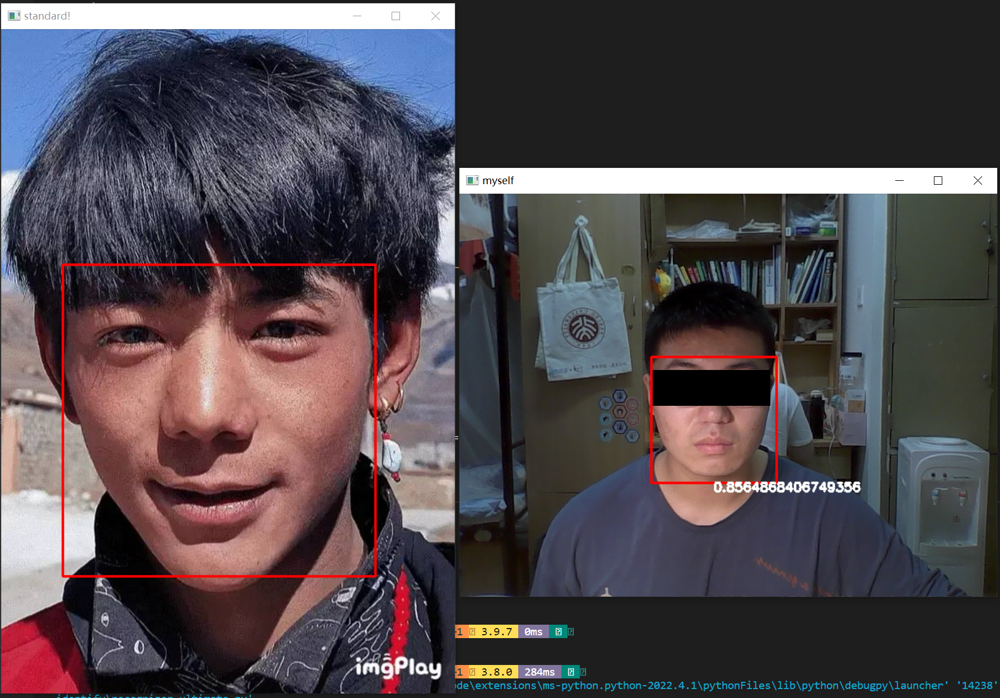

# 用python教你如何做一个和丁真的脸型比对的小玩具!

***


> 没错,时隔3天，我又回来了。对于自己的处女作，总是感到惴惴不安，一方面，因为这就是个玩具，怕被各路大神笑话，另一方面又觉得，处女作要是留下什么粗糙那就悲了，于是本着readme立下的flag，在此出个教程，或许之前已经有类似的或雷同的，请纯属巧合，也请各路大神嘴下留情，纸鹤不胜感激！


## 正片开始

好的，废话不多说，下面就可以开始教学了！

**内容是** ：100行代码如何做一个**人脸相似度**的东东？

其实非常简单啊，先看一下效果：




> ~~请忽略丑丑的还像是被抓卖淫的图片,毕竟只有0.85左右的相似度(bushi)~~
>
> 或许和丁真不那么像还是件好事,是吧(doge) ~~不针对任何丁真粉~~


### 下面开始!

#### 前戏准备

> 首先需要准备一些东西

- `numpy`,一个开源的python科学计算包,强大到conda的base环境自带`numpy`  

  > 用`numpy`的原因是这个东东需要涉及到一些数学计算问题 

- `opencv`,也是一个开源的python库,用于计算机视觉方面    

- `dlib`,一个开源的机器学习库,因为人脸识别做得很好所以比较著名的说     

> 如果你的环境中已经有这三个库,那么可以点击右上角退出了,因为你大概率已经会这些了 ~~(或者也可以朝下看看然后嘲笑一下这篇教程的作者,他真菜,出这么低级的教程)~~
>
> 上面的库都装完以后,还需要一个东西,已经在repo里了,就是那个res文件夹下的`shape_predictor_68_face_landmarks.dat`,用处待会再说

如果想要更方便地安装上面的三个库,可以

> `pip install -r requirements.txt`

最好换成国内的pypi源,下载速度会高一点

> `pip install -r requirements.txt -i https://pypi.tuna.tsinghua.edu.cn/simple` 

我建议你从头开始,跟着这篇教程做一遍,思路会清晰一些,而不是看着我的 ~~屎码~~ 半天摸不着头脑    

#### 从摄像头读入你的face!

选择一个文件夹,在文件夹下新建一个python脚本文件`xxx.py`,将刚才准备的三大金刚请出来     

```python
import numpy as np
import dlib
import cv2
```

> `import sys`可选,主要是命令行参数要用,不用这个并不会影响到核心功能


首先将人脸通过摄像头读入

```python
#用到cv2这个库
cap = cv2.VideoCapture(0)
#实现持续截取摄像头画面并输出到屏幕上,就是连续的了
while True:
    ret,self_img = cap.read()
    self_img = cv2.flip(self_img,1)#镜像翻转摄像头的画面
    cv2.imshow('myself',img)
    cv2.waitKey(1)
```

> `cv2.VideoCapture(0)`代表默认摄像头,如果有多个摄像头而显示的不是你的预期,请换成1,2,.....直到报错,总有一款适合你      
>
> `cv2.imshow(text,img)`显示以text为标题,img为图片的窗口(text参照上图standard和myself)     
>
> `cv2.waitKey()`代表等待用户按下键盘的键才继续,这个不用管           


如果你成功了,你应该会在屏幕上看到一个人脸,如上图右不带红框和数字的样子(当然肯定不会有那个黑框,那个黑条是干嘛的呢?)        

***

#### 人脸识别!

如何把这张脸识别出来呢?  答案是`dlib`!

```python
def face_locator(img):
    detector = dlib.get_frontal_face_detector()
    dets = detector(img,0)
    if not dets:
        return None
    return max(dets,key = lambda d:d.area())
```

> `dlib.get_frontal_face_detector()`这个东东很神奇,可以将所有的人脸弄进一个列表里然后返回这个列表
>
> 最后返回最大的那张人脸 ~~(还不是为了防止被抢镜,所以请时刻保证在摄像头的视野中,你是最靓的靓仔)~~ ,用lambda表达式指定以面积为指标

#### 提取特征!

上面那个函数返回一个元素,我们虽然不知道这个元素是什么,但它有一些方法可以供我们操纵

令face = face_locator(img),则有以下`face.left()`,`face.right()`,`face.top()`,`face.bottom()`,`face.area()`,`face.width()`,`face.height()`等方法

用法一目了然,但现在暂时不用,待会会用到   


所以face现在就是个有坐标的矩形框,我们要从这个矩形框里面提取出脸的特征

```python
def extract_features(img,face):
    predictor = dlib.shape_predictor('res/shape_predictor_68_face_landmarks.dat')
	key_points = []
    landmark = predictor(img,face)
    for i in range(68):
		pos = landmark.part(i)
        key_points.append(np.array([pos.x,pos.y],dtype = np.float32))
    return key_points
```

> 这一步最关键的就是shape_predictor_68_face_landmarks.dat`,这个东西是dlib训练好的,可以提取人脸68特征点的一个模型       
>
> landmark就是一个类似于列表的东西,存放着68个点,访问每个点需要`part(下标)`  
>
> 但我们之后要用的是68个点而不是这个列不列表不表的鬼东西,而且这个"点"是dlib自己的一种数据结构,无法被其他库共用    
>
> 所以我们将这68个点一个一个一个提取出来变成numpy数组**(方便后续向量计算)**放入key_points列表,就达到了提取的效果       

> **题外话** :想要让python发挥**胶水语言**的功能,常常要借助比较底层的东西(本例**numpy**数组比较接近底层),可以更方便地黏合不同的包   

#### 比对特征

上一步我们获得了一个含有68个点的列表`key_points`,这一步我们要完成比对,所以我们将丁真先生请出来  

按照上面的方法,如法炮制即可  

```python
dingzhen_img = cv2.imread('res/std_dingzhen.jpg')
dingzhen_locator = face_locator(dingzhen_img)
dingzhen_key_points = extract_features(dingzhen_img,dingzhen_locator)
```

现在我们得到了两个关键点列表`key_points` `dingzhen_key_points`    

但是现在这两个68点,他们的坐标不一样,同样都是鼻头,一个在图像中间,另一个在图像边缘,怎么比对呢?   


小学二年级的课程会教你平面向量这个东西,所以我们只需要将两个点作差,就可以得到一个向量   

点的坐标是绝对的,而向量的坐标是相对的,这样就解决了点的坐标不同的问题

```python
for i in range(68):
	key_points[i]-=key_points[0]
    dingzhen_key_points[i]-=dingzhen_key_points[0]
```


然后我们就可以比对对应向量的差距,可以用欧几里得距离,即两个同尾向量,头部之间的距离  

>  欧氏距离越大,两向量差距越大,对应的部分就越不像,如果这个差距被累积起来,就可以衡量整张人脸的差距

按照这个思路,我们来计算对应向量欧氏距离的总和

```python
sum = 0
for i in range(68):
    sum+=np.linalg.norm(key_points[i]-dingzhen_key_points[i])
```

> np.linalg.norm()是用来计算向量范数的,默认情况下就是计算模长,即两向量的欧氏距离
>
> 因为两向量作差就是一个向量嘛


这样我们得到了欧氏距离的和,这个和越大,就说明两张脸越不像,很好理解   

但是我们要的是**相似度**啊,**相似度**是一个比率啊!   

所以我们需要一个能把实数映射到0到1之间的函数   

> 这时候可能有深度学习基础的小伙伴就懂了,这不就是激活函数嘛

再结合0到1的范围,我们便可以确定两个函数符合我们的要求

- `sigmoid`函数
- tanh(双曲正切函数)


1. **sigmoid**函数,解析式  **$f(x)=\frac{1}{1+e^{-x}}$**,图象如下图


<iframe src="https://www.desmos.com/calculator/h39kqklrht?embed" width="500" height="500" style="border: 1px solid #ccc" frameborder=0></iframe>


2. **tanh**双曲正切函数,解析式    $f(x)=\frac{e^x-e^{-x}}{e^x+e^{-x}}$,图象如下图


<iframe src="https://www.desmos.com/calculator/6xtqpghvcf?embed" width="500" height="500" style="border: 1px solid #ccc" frameborder=0></iframe>


经过深思熟虑,我选择了tanh,理由如下:

- tanh可以直接调用numpy中的函数`np.tanh()`,比较省心,而如果是sigmoid就得手写,不过也不难

  ```python
  def sigmoid(x):
  	return 1/1+np.exp(-x)
  ```

  > 就两行而已我看谁敢说麻烦!

- **重点**:其实是我们的欧氏距离之和一定是一个正数,而能把正数映射到0到1之间的只有tanh,而sigmoid会卡在0.5的下限,需要加偏置,过于麻烦

所以换算如下:

```python
rate = 1-np.tanh(sum/10000)
```

> - 首先是一个大小问题,欧氏距离和越大,相似度越小,所以要用1减一下
> - 这里用了sum/10000是因为根据上图,tanh在x>2的时候就已经趋近于1了,发生了梯度消失.为了让rate能够拉开差距,我们需要将sum给压缩到0到2这个区间,而欧式距离是像素为单位,所以除以10000是差不多的一个范围.

至此,计算部分结束!    

而最终得到的这个rate,就是第一张图中我的脸下面的那一串数字  

#### 图像重新处理

> 等一下,我们是不是**忘了什么**?  
>
> 抱歉,又要开始计算了,不过我保证,**这是最后一次!**

- 在[提取特征](#提取特征)这一步,我们直接将框内的68特征点拿出来,在[比对特征](#比对特征)这一步就直接向量化并且计算了欧氏距离  

- 但是,即使是同一张脸,向量长度也会因为脸框的大小不同而不同,这样欧氏距离就不单单是受脸型的影响了
- 换句话说,就是脸框大小不同时,欧氏距离不能衡量两张脸的差距
- 而脸框大小很容易就会受到你离摄像头距离的影响,如果近了,很显然就是大头照

所以还需要处理一下,将摄像头收到的图片按照脸框大小进行缩放,使得缩放后你的照片和丁真先生的照片中,人脸框的大小是一样的

```python
def reprocess(std_face_loc,self_img,self_face_loc):
    std_width = std_faceloc.width()
    std_height = std_faceloc.height()
    self_width = self_faceloc.width()
    self_height = self_faceloc.height()
    new_img = cv2.resize(img,None,fx = std_width/self_width,fy = std_height/self_height,\
                        interpolation = cv2.INTER_LINEAR if std_height > self_height else cv2.INTER_AREA)
    return new_img
```

> `cv2.resize()`函数,将指定图像缩放大小,有一些参数在此说明
>
> 1. img,传入的图像
> 2. dsize = None,第一种缩放方式,如果传入一个元组则将img缩放成以元组为长宽的图象,这里选用None是为了用第二种缩放方式
> 3. fx,fy,第二种方式,指定缩放比例.将原图像的边长乘以对应的比例即为新的图象边长,这里的比例是人脸框的比例,为了达到人脸框大小相同的目的
> 4. interpolation,插值方式,在需要放大时选用线性插值(LINEAR),缩小时采用区域插值(AREA),综合性能和效果都很不错

这样,对new_img进行采样取特征就没有问题了.
